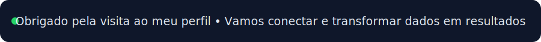

  

  
  
  

---

## 🚀 Sobre mim

Sou um profissional focado em **análise de dados**, **indicadores de performance** e **visualização executiva**. Meu objetivo é conectar dados ao negócio, criando análises claras que apoiam decisões com rapidez e segurança.

- 📊 Experiência com construção de dashboards e monitoramento de KPIs
- 🧠 Visão analítica com foco em eficiência operacional e resultados
- 🤝 Comunicação orientada ao negócio para transformar números em ações

---

## 🛠️ Stack e Ferramentas

### 📊 Business Intelligence

  
  
  
  
  

### ⚙️ ETL & Automação

  
  
  

### 💻 Linguagens

  
  
  
  

---

## 📈 Destaques de Projetos

**Dashboards & BI:**
- Mashup da Saúde *(Qlik Sense)*
- Painel de Gestão Atendimentos no Carnaval *(Qlik Sense)*
- Painel Executivo Planejamento de Recursos *(Power BI)*

**Automação & Integração:**
- Hub Dashboards *(Power Apps + Power Automate)*
- Fluxo de Coberturas Vacinais *(Alteryx)*

**Componentes & Extensões:**
- Extensão de Alerta *(Qlik Sense)*

---

## 🎯 Proposta de Valor

✅ Transformar grandes volumes de dados em insights acionáveis  
✅ Construir painéis intuitivos para times técnicos e executivos  
✅ Apoiar metas de negócio com indicadores confiáveis

---

## 🌐 Portfólio

Acesse meu portfólio interativo:

  

---

  

